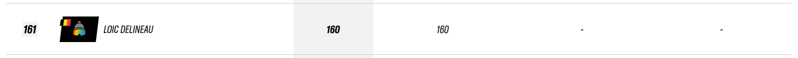
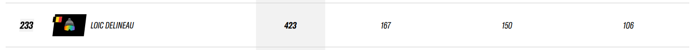

# Freeride Competitions - Overview of all Seasons
## Lifelong Overview
| Year |    Tour   | Nb Comps | FWT pts | European Ranking |
| :--  |    :---:  |  :---:   | :---:   |     :---:        |
| 2016 |    Junior |    1     |   160   |      161st       |
| 2017 |      /    |    0     |   0     |       /          |
| 2018 |      /    |    0     |   0     |       /          |
| 2019 |      /    |    0     |   0     |       /          |
| 2020 |      /    |    0     |   0     |       /          |
| 2021 |      /    |    0     |   0     |       /          |
| 2022 |      /    |    0     |   0     |       /          |
| 2023 |      /    |    0     |   0     |       /          |
| 2024 | Qualifier |    4     |   423   |      233rd       | 
| 2025 | Qualifier |   ...    |   ...   |      ...         | 

## 2015-2016 Ski Season
**161st Junior U17 Category** [(link)](https://www.freerideworldtour.com/junior/rankings/ski-men/?region=europe-asia-oceania&season=2016)

| ID  | Country     | Resort | Tour  | Level |  Date      | Score  | Podium | FWT pts |
| :-- | :---:	    | :---:  | :---: | :---: |  :---:     | :---:  | :---:  | :---:   |
| #1  | Switzerland | Nendaz | Junior| 2*    | 06/03/2016 | ??.??  | 11/55  | 160     |

Total Season Points (3 Best Events) : **160pts**			    

[Details of 2015-2016 Ski Season](./2016-season/README.md) 
 
 

## 2023-2024 Ski Season
**233st European Ski Men Qualifier** [(link)](https://www.freerideworldtour.com/qualifier/rankings/ski-men/?region=europe-asia-oceania&season=2024)

| ID  | Country     | Resort | Tour      | Level |  Date      | Score | Podium | FWT pts |
| :-- | :---:	    | :---:  | :---:     | :---: |  :---:     | :---: | :---:  | :---:   |
| #1  | Switzerland | Bruson | Qualifier | 2*    | 20/02/2024 | 68.67 | 10/44  | 167     |
| #2  | Switzerland | Bruson | Qualifier | 2*    | 22/02/2024 | 56.00 | 25/53  | 106     |
| #3  | France  | Le Dévoluy | Qualifier | 1*    | 13/03/2024 | ??.?? | 4/21   | 150     |
| #4  | France     | Avoriaz | Qualifier | 2*    | 25/03/2024 | ??.?? | 28/52  | 100     |

Total FWT Season Points (3 Best Events) : **423pts**			    

[Details of 2023-2024 Ski Season](./2024-season/README.md) 

 

## 2024-2025 Ski Season
**...st European Ski Men Qualifier** [(link)](https://www.freerideworldtour.com/qualifier/rankings/ski-men/?season=2025&region=europe-asia-oceania) \

| ID  | Country     | Resort   | Tour      | Level |  Date      | Score | Podium | FWT pts |
| :-- | :---:	    | :---:    | :---:     | :---: |  :---:     | :---: | :---:  | :---:   |
| #1  | Switzerland | Nendaz   | Qualifier | 1*    | 04/01/2025 | 70.33 | 3/22   | 185     |
| #2  | Switzerland | Verbier  | Qualifier | 2*    | 06/01/2025 | 52.00 | 34/47  | 90      |
| #3  | Switzerland | Bruson   | Qualifier | 2*    | 17/02/2025 | ??.?? | ??/??  | ?     |
| #4  | Switzerland | Nendaz   | Qualifier | 2*    | 24/02/2025 | ??.?? | ??/??  | ?     |
| #5  | Switzerland | Nendaz   | Qualifier | 3*    | 26/02/2025 | ??.?? | ??/??  | ?     |
| #6  | France      | Bonneval | Qualifier | 3*    | 15/03/2025 | ??.?? | ??/??  | ?     |
| #7  | France      | Valfrejus| Qualifier | 3*    | 19/03/2025 | ??.?? | ??/??  | ?     |

Total FWT Season Points (3 Best Events) : **...pts**			    

[Details of 2024-2025 Ski Season](./2025-season/README.md) 

https://liveheats.com/events/286619/divisions/493637
https://liveheats.com/events/286655/divisions/493658

 

